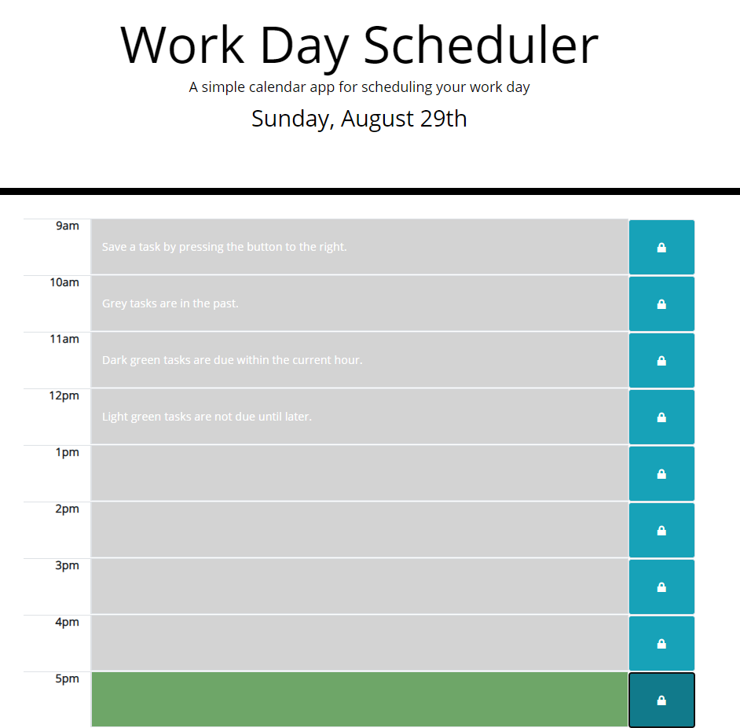

# Work Day Scheduler

## Description

This application is a 9-5 workday task scheduler  
  
The application is created to help the user better plan their 9-5 work day. The user can save tasks by the hour and reload the page and they will persist. The user will have color indication to show weather the task is in the past, present, or future to better manage their tasks at a glance.

## User Story  

AS AN employee with a busy schedule  
I WANT to add important events to a daily planner  
SO THAT I can manage my time effectively  

## Acceptance Criteria  

GIVEN I am using a daily planner to create a schedule  
WHEN I open the planner  
THEN the current day is displayed at the top of the calendar  
WHEN I scroll down  
THEN I am presented with time blocks for standard business hours  
WHEN I view the time blocks for that day  
THEN each time block is color-coded to indicate whether it is in the past, present, or future  
WHEN I click into a time block  
THEN I can enter an event  
WHEN I click the save button for that time block  
THEN the text for that event is saved in local storage  
WHEN I refresh the page  
THEN the saved events persist  

Screenshot: 

Working Url: https://johnson90cm.github.io/workday-scheduler/